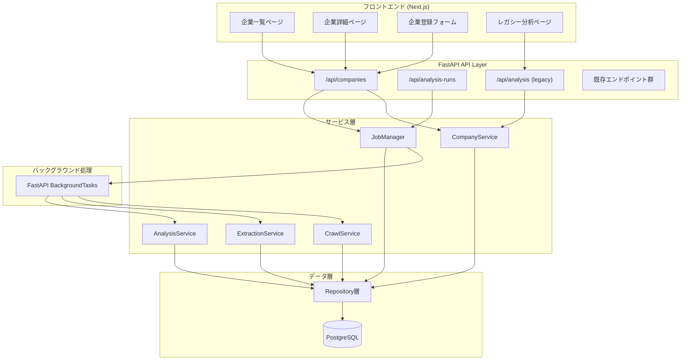
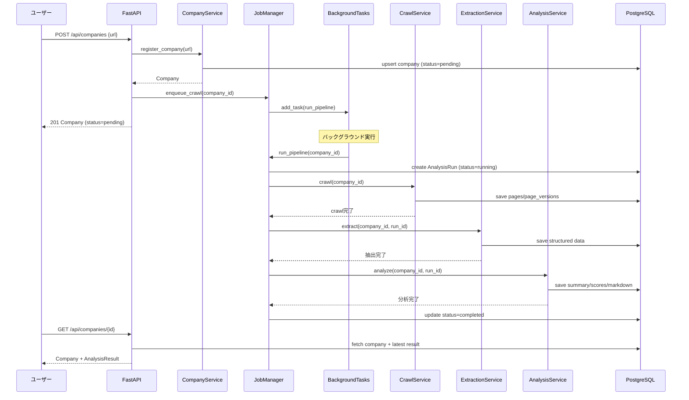
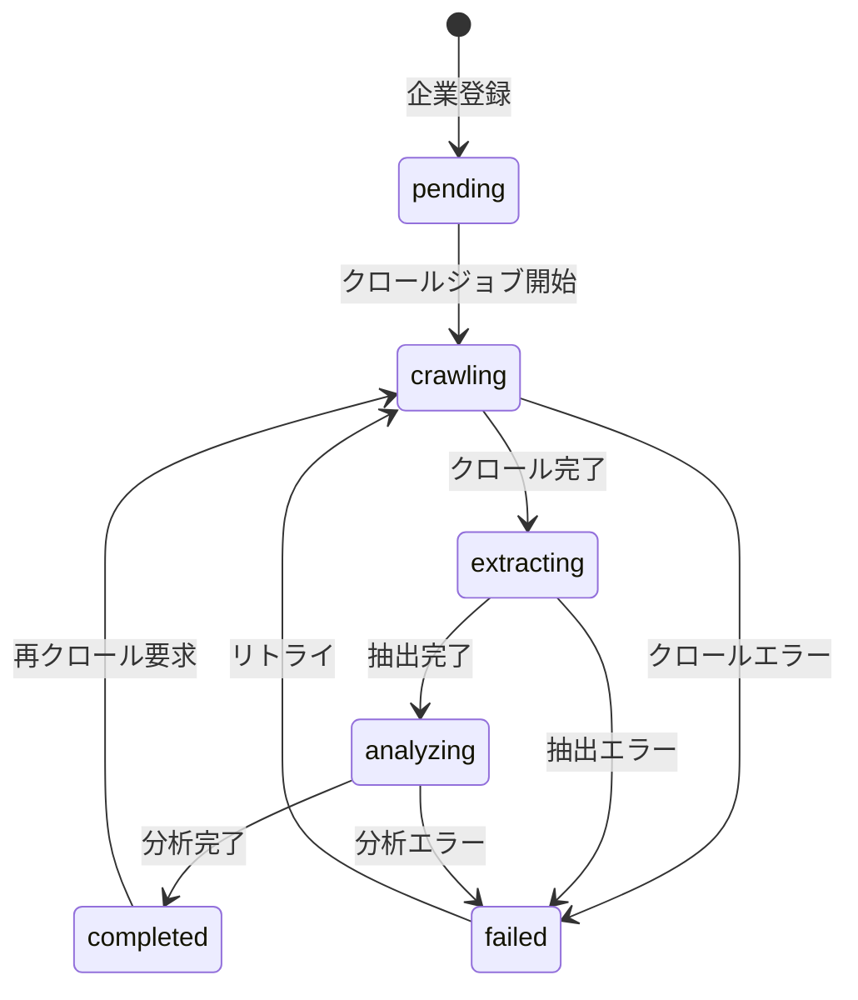
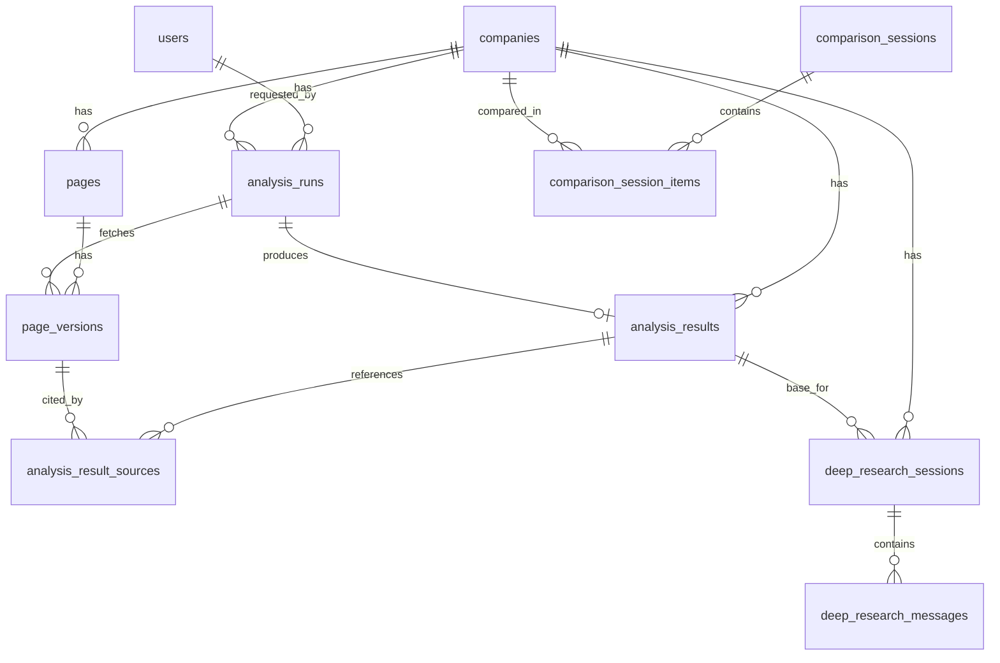

# 設計書: 企業分析ワークフロー変革

## 概要

本設計書は、現行の同期型URL即時分析システムを、企業登録ファースト型の非同期ワークフローに変革するためのアーキテクチャ設計を定義する。

### 設計方針

- 既存のモジュラーモノリス構成（FastAPI + SQLAlchemy async）を維持しつつ、サービス層を分割する
- 既存のDBスキーマ（11テーブル）はそのまま活用し、破壊的変更を行わない
- 非同期処理は FastAPI BackgroundTasks で PoC を実装し、将来の Celery/SQS 移行を妨げない
- 既存エンドポイント（POST /api/analysis 等）は後方互換で維持する
- フロントエンドは FSD 構成を維持し、Orval 自動生成で新APIに対応する

### 統合対象の既存spec

| 既存spec | 本設計での扱い |
|----------|--------------|
| company-analysis-core | サービス分割・非同期化で置換 |
| data-persistence | 既存DBスキーマをそのまま活用 |
| diff-refresh | 再分析ポリシーとして統合 |
| deep-research | 既存機能維持 + Deep Analysis として拡張 |
| analysis-history | 企業詳細画面に統合 |
| download | 既存機能維持 |
| analysis-template-scoring | Deep Analysis のテンプレート機能として統合 |
| company-search | 既存機能維持 |
| share | 既存機能維持 |
| compare | 既存機能維持 |
| clerk-google-auth | 既存機能維持 |

## アーキテクチャ

### 全体構成



### 処理フロー

#### 企業登録→バックグラウンド分析フロー



#### 状態遷移図



## コンポーネントとインターフェース

### サービス層の分割

現行の `analyze_company()` 関数（`server/src/analysis/service.py`）を以下の5つのサービスに分割する。

#### CompanyService

```python
# server/src/companies/service.py
class CompanyService:
    """企業の登録・検索・基本情報管理"""

    async def register_company(self, url: str, user_id: uuid.UUID | None = None) -> Company:
        """企業URLを登録する。重複時は既存レコードを返却。"""
        ...

    async def get_company(self, company_id: uuid.UUID) -> Company:
        """企業詳細を取得する。"""
        ...

    async def list_companies(self, user_id: uuid.UUID | None = None) -> list[Company]:
        """企業一覧を取得する。"""
        ...

    async def update_display_name(self, company_id: uuid.UUID, name: str) -> Company:
        """表示名を更新する（LLM抽出結果から）。"""
        ...
```

#### CrawlService

```python
# server/src/crawler/service.py
class CrawlService:
    """企業サイトのクロール・ページ収集"""

    async def crawl(self, company_id: uuid.UUID, run_id: uuid.UUID) -> CrawlResult:
        """企業サイトをクロールし、pages/page_versionsに保存する。
        既存の collector/service.py の collect_company_info() をラップする。"""
        ...
```

#### ExtractionService

```python
# server/src/extraction/service.py
class ExtractionService:
    """収集ページからの構造化データ抽出"""

    async def extract(self, company_id: uuid.UUID, run_id: uuid.UUID) -> StructuredData:
        """page_versionsから構造化データを抽出する。
        既存の _extract_structured() をラップする。"""
        ...
```

#### AnalysisService

```python
# server/src/analysis/analysis_service.py
class AnalysisService:
    """要約・SWOT・スコアリング・レポート生成"""

    async def analyze(
        self, company_id: uuid.UUID, run_id: uuid.UUID, template: str = "general"
    ) -> AnalysisResult:
        """構造化データから要約・スコア・レポートを生成する。
        既存の _generate_summary_and_scores() をラップする。"""
        ...

    async def run_deep_analysis(
        self, company_id: uuid.UUID, template: str
    ) -> AnalysisResult:
        """蓄積データに対するテンプレート別再分析。フルクロールなし。"""
        ...
```

#### JobManager

```python
# server/src/jobs/manager.py
class JobManager:
    """バックグラウンドジョブのオーケストレーション"""

    async def enqueue_full_pipeline(
        self, company_id: uuid.UUID, background_tasks: BackgroundTasks
    ) -> AnalysisRun:
        """クロール→抽出→分析のフルパイプラインをキューに追加する。"""
        ...

    async def run_pipeline(self, company_id: uuid.UUID, run_id: uuid.UUID) -> None:
        """パイプラインを実行する（BackgroundTasksから呼ばれる）。"""
        ...

    async def get_run_status(self, run_id: uuid.UUID) -> AnalysisRun:
        """ジョブの状態を取得する。"""
        ...
```

### 新規ルーター

```python
# server/src/companies/router.py
router = APIRouter(prefix="/api/companies", tags=["companies"])

@router.post("", response_model=CompanyResponse, status_code=201)
async def register_company(request: RegisterCompanyRequest, ...) -> CompanyResponse: ...

@router.get("", response_model=CompanyListResponse)
async def list_companies(...) -> CompanyListResponse: ...

@router.get("/{company_id}", response_model=CompanyDetailResponse)
async def get_company(company_id: uuid.UUID, ...) -> CompanyDetailResponse: ...

@router.post("/{company_id}/crawl", response_model=RunStatusResponse)
async def start_crawl(company_id: uuid.UUID, ...) -> RunStatusResponse: ...

@router.post("/{company_id}/analysis-runs", response_model=RunStatusResponse)
async def start_analysis(company_id: uuid.UUID, request: StartAnalysisRequest, ...) -> RunStatusResponse: ...

@router.get("/{company_id}/analysis-results/latest", response_model=AnalysisResponse)
async def get_latest_result(company_id: uuid.UUID, ...) -> AnalysisResponse: ...

@router.get("/{company_id}/analysis-results", response_model=AnalysisHistoryResponse)
async def list_results(company_id: uuid.UUID, ...) -> AnalysisHistoryResponse: ...
```

```python
# server/src/jobs/router.py
router = APIRouter(prefix="/api/analysis-runs", tags=["jobs"])

@router.get("/{run_id}", response_model=RunStatusResponse)
async def get_run_status(run_id: uuid.UUID, ...) -> RunStatusResponse: ...
```

### 新規Pydanticスキーマ

```python
# server/src/companies/schemas.py

class RegisterCompanyRequest(BaseModel):
    url: str = Field(..., min_length=1, pattern=r"^https?://.*")

class CompanyResponse(BaseModel):
    company_id: uuid.UUID
    primary_url: str
    normalized_url: str
    display_name: str | None
    status: str
    last_page_crawl_at: datetime | None
    last_analyzed_at: datetime | None
    analysis_count: int
    created_at: datetime

class CompanyListResponse(BaseModel):
    companies: list[CompanyResponse]

class CompanyDetailResponse(CompanyResponse):
    latest_result: AnalysisResponse | None = None
    recent_runs: list[RunSummary] = []

class StartAnalysisRequest(BaseModel):
    template: str = "general"
    force_refresh: bool = False

class RunStatusResponse(BaseModel):
    run_id: uuid.UUID
    company_id: uuid.UUID
    status: str  # pending, running, completed, failed
    run_type: str
    template: str
    started_at: datetime | None
    completed_at: datetime | None
    duration_ms: int | None
    error_message: str | None
    result_id: uuid.UUID | None = None
```

## データモデル

### 既存テーブルの活用（変更なし）

既存の11テーブル（`docs/database-design.md` 参照）はすべてそのまま活用する。スキーマ変更は不要。

| テーブル | 本設計での役割 |
|---------|--------------|
| users | Clerk認証ユーザー管理（変更なし） |
| companies | 企業登録の正本。status フィールドで処理状態を管理 |
| pages | クロール結果のページ資産（変更なし） |
| page_versions | ページ取得時点の本文保存（変更なし） |
| analysis_runs | ジョブ実行履歴。run_type で crawl/extract/analyze/full を区別 |
| analysis_results | 分析成果物の保存（変更なし） |
| analysis_result_sources | 分析根拠の追跡（変更なし） |
| deep_research_sessions | 深掘りリサーチセッション（変更なし） |
| deep_research_messages | 深掘りリサーチメッセージ（変更なし） |
| comparison_sessions | 比較セッション（変更なし） |
| comparison_session_items | 比較対象企業（変更なし） |

### Company.status の活用

既存の `companies.status` フィールド（現在は "active" 固定）を処理状態管理に拡張する。

```
status の値:
- "pending"    : 登録直後、クロール未実行
- "crawling"   : クロール実行中
- "extracting" : 構造化抽出実行中
- "analyzing"  : 要約・スコアリング実行中
- "completed"  : 全処理完了
- "failed"     : いずれかのフェーズでエラー
- "active"     : レガシー互換（既存データ）
```

### analysis_runs.run_type の拡張

既存の run_type（"initial", "refresh"）に加え、以下を追加する。

```
run_type の値:
- "initial"       : 初回フル分析（既存）
- "refresh"       : 再分析（既存）
- "crawl_only"    : クロールのみ
- "deep_analysis" : テンプレート別深掘り分析（蓄積データ使用）
```

### ER図



## バックグラウンドジョブ設計

### FastAPI BackgroundTasks による実装

```python
# server/src/jobs/manager.py

class JobManager:
    def __init__(self, session: AsyncSession):
        self.session = session
        self.run_repo = AnalysisRunRepository(session)
        self.company_repo = CompanyRepository(session)

    async def enqueue_full_pipeline(
        self,
        company_id: uuid.UUID,
        background_tasks: BackgroundTasks,
        template: str = "general",
        force_refresh: bool = False,
    ) -> AnalysisRun:
        run = AnalysisRun(
            company_id=company_id,
            run_type="initial",
            template=template,
            status="pending",
            force_refresh=force_refresh,
        )
        run = await self.run_repo.create(run)
        await self.session.commit()

        # BackgroundTasksに登録（非同期で実行される）
        background_tasks.add_task(
            self._run_pipeline, company_id, run.run_id, template
        )
        return run

    async def _run_pipeline(
        self, company_id: uuid.UUID, run_id: uuid.UUID, template: str
    ) -> None:
        """パイプライン実行（新しいDBセッションを使用）"""
        async with get_async_session() as session:
            try:
                # Phase 1: Crawl
                await self._update_company_status(session, company_id, "crawling")
                crawl_service = CrawlService(session)
                crawl_result = await crawl_service.crawl(company_id, run_id)

                # Phase 2: Extract
                await self._update_company_status(session, company_id, "extracting")
                extraction_service = ExtractionService(session)
                structured = await extraction_service.extract(company_id, run_id)

                # Phase 3: Analyze
                await self._update_company_status(session, company_id, "analyzing")
                analysis_service = AnalysisService(session)
                await analysis_service.analyze(company_id, run_id, template)

                # 完了
                await self._update_company_status(session, company_id, "completed")
                await session.commit()

            except Exception as e:
                await self._handle_failure(session, company_id, run_id, e)
```

### 将来のスケーリング対応

現在の BackgroundTasks は単一プロセス内で動作するため、以下の制約がある：
- サーバー再起動でジョブが失われる
- 水平スケーリングできない

将来的に Celery/Redis Queue に移行する際は、`JobManager.enqueue_full_pipeline()` の内部実装を差し替えるだけで対応可能な設計とする。

```python
# 将来の Celery 移行イメージ
# background_tasks.add_task(...) → celery_app.send_task(...)
```

## キャッシュ・再分析ポリシー

| 条件 | 動作 |
|------|------|
| force_refresh=false + 最新結果あり | 最新の analysis_results を返却 |
| force_refresh=true | 再クロール→再抽出→再分析 |
| Deep Analysis | 蓄積 pages/page_versions を使用、クロールなし |
| 同一URL登録 | 既存 company レコードを返却（重複防止） |

### 差分レポート生成

再分析時（force_refresh=true）は、前回の structured データと今回の structured データを比較し、diff_report を生成する。既存の `generate_diff_report()` 関数（`server/src/shared/text.py`）をそのまま活用する。

## マイグレーション戦略

### Phase 1: サービス層分割（既存フロー維持）

1. `CompanyService`, `CrawlService`, `ExtractionService`, `AnalysisService`, `JobManager` を新規作成
2. 各サービスは既存の関数（`collect_company_info()`, `_extract_structured()`, `_generate_summary_and_scores()`）をラップする
3. 既存の `analyze_company()` は内部で新サービスを呼び出すようリファクタリング
4. 既存エンドポイントの動作は変更なし

### Phase 2: 新規エンドポイント追加

1. `/api/companies` 系エンドポイントを追加
2. `/api/analysis-runs/{run_id}` エンドポイントを追加
3. 既存エンドポイントは並行稼働

### Phase 3: フロントエンド移行

1. 企業一覧・詳細ページを新規作成
2. 企業登録フォームを新規作成
3. 既存の分析ページはレガシーモードとして維持
4. Orval 再生成で新APIに対応

### ディレクトリ構成の変更

```
server/src/
├── analysis/          # 既存（レガシー分析 + AnalysisService）
│   ├── router.py      # 既存エンドポイント維持
│   ├── service.py     # リファクタリング（新サービス呼び出し）
│   ├── analysis_service.py  # 新規: 要約・スコア・レポート生成
│   ├── schemas.py     # 既存スキーマ維持
│   └── prompts.py     # 既存プロンプト維持
├── companies/         # 新規: 企業管理
│   ├── router.py      # 新規エンドポイント
│   ├── service.py     # CompanyService
│   └── schemas.py     # 新規スキーマ
├── crawler/           # 新規: クロールサービス
│   └── service.py     # CrawlService（collector をラップ）
├── extraction/        # 新規: 抽出サービス
│   └── service.py     # ExtractionService
├── jobs/              # 新規: ジョブ管理
│   ├── router.py      # ジョブ状態エンドポイント
│   └── manager.py     # JobManager
├── collector/         # 既存（変更なし）
├── auth/              # 既存（変更なし）
├── db/                # 既存（変更なし）
├── deep_research/     # 既存（変更なし）
├── download/          # 既存（変更なし）
├── search/            # 既存（変更なし）
└── shared/            # 既存（変更なし）
```


## 正当性プロパティ（Correctness Properties）

*プロパティとは、システムのすべての有効な実行において成立すべき特性や振る舞いのことである。プロパティは、人間が読める仕様と機械的に検証可能な正当性保証の橋渡しとなる。*

以下のプロパティは、要件定義書の受入基準から導出した、プロパティベーステストで検証すべき普遍的な性質である。

### Property 1: URL正規化の一貫性

*For any* 有効な企業URL、URL正規化処理を適用した結果の normalized_url はスキーム+ドメインのみを含み、primary_domain はドメイン部分のみを含む。同一ドメインの異なるパスを持つURLは同一の normalized_url を生成する。

**Validates: Requirements 1.3**

### Property 2: 企業登録の冪等性（URL重複防止）

*For any* 企業URL、同一の正規化URLで2回登録を試みた場合、2回目は新規レコードを作成せず既存レコードを返却する。登録前後で companies テーブルの当該 normalized_url のレコード数は1のままである。

**Validates: Requirements 1.2, 7.4**

### Property 3: 企業登録の初期状態とジョブ自動投入

*For any* 新規企業URL、登録直後の Company レコードの status は "pending" であり、対応する Analysis_Run レコードが作成される。

**Validates: Requirements 1.1, 1.5**

### Property 4: 企業一覧・詳細レスポンスの完全性

*For any* 登録済み企業、一覧APIのレスポンスには company_id, primary_url, display_name, status, last_page_crawl_at, last_analyzed_at, analysis_count が含まれる。詳細APIのレスポンスにはさらに latest_result と recent_runs が含まれる。

**Validates: Requirements 2.1, 2.2**

### Property 5: パイプライン状態遷移の正当性

*For any* 企業のフルパイプライン実行において、Company_Status は pending → crawling → extracting → analyzing → completed の順序で遷移する。各フェーズの開始時に対応する status が設定され、完了時に次のフェーズに遷移する。

**Validates: Requirements 3.1, 4.1, 4.3, 4.5**

### Property 6: クロール結果の永続化

*For any* 正常完了したクロールジョブ、収集されたページ数と同数の pages レコードが存在し、各 page に対応する page_versions レコードが存在する。Company の last_page_crawl_at はクロール完了時刻以降の値に更新される。

**Validates: Requirements 3.2, 3.3**

### Property 7: パイプライン失敗時のエラー記録

*For any* パイプラインフェーズ（crawl, extract, analyze）で例外が発生した場合、Company_Status は "failed" に更新され、対応する Analysis_Run に error_code と error_message が記録される。

**Validates: Requirements 3.4, 4.6**

### Property 8: 構造化抽出結果の保存

*For any* 正常完了した抽出ジョブ、analysis_results の structured フィールドには company_profile, business_domains, products, financials, news, risks のキーが含まれる。

**Validates: Requirements 4.2**

### Property 9: 分析結果の保存

*For any* 正常完了した分析ジョブ、analysis_results には summary（overview, business_model, swot を含む）、scores、markdown_page が保存される。

**Validates: Requirements 4.4**

### Property 10: ジョブ状態追跡のタイムスタンプ整合性

*For any* 完了した Analysis_Run、started_at は completed_at 以前であり、duration_ms は正の値であり、collection_summary にはフェーズ情報が含まれる。

**Validates: Requirements 5.2, 5.3**

### Property 11: Deep Analysis の蓄積データ活用

*For any* 蓄積データを持つ企業に対する Deep Analysis 要求、新しい Analysis_Run（run_type="deep_analysis"）と analysis_results が作成され、指定テンプレートが result の template フィールドに反映される。新しい pages/page_versions は作成されない。

**Validates: Requirements 6.1, 6.2, 6.3**

### Property 12: キャッシュヒット（force_refresh=false）

*For any* 分析結果が存在する企業に対する force_refresh=false のリクエスト、新しい Analysis_Run は作成されず、既存の最新 analysis_results が返却される。

**Validates: Requirements 7.1**

### Property 13: 強制リフレッシュによる新規パイプライン

*For any* force_refresh=true のリクエスト、新しい Analysis_Run が作成され、クロールから再実行される。

**Validates: Requirements 7.2**

### Property 14: 再分析時の差分レポート生成

*For any* 既存の分析結果がある企業の再分析、新しい analysis_results の diff_report フィールドは空文字列ではなく、前回と今回の structured データの差分情報を含む。

**Validates: Requirements 7.3**

### Property 15: レガシー分析の後方互換性

*For any* POST /api/analysis へのリクエスト、レスポンスは既存の AnalysisResponse スキーマに準拠し、内部的に company レコードと pages/page_versions が保存される。

**Validates: Requirements 8.2, 8.3**

## エラーハンドリング

### エラー分類

| エラー種別 | 発生箇所 | 対応 |
|-----------|---------|------|
| CollectionError | CrawlService | Company_Status → "failed"、error_code="COLLECTION_ERROR" |
| AnalysisError | ExtractionService, AnalysisService | Company_Status → "failed"、error_code="ANALYSIS_ERROR" |
| ExternalServiceError | LLM呼び出し | Company_Status → "failed"、error_code="EXTERNAL_SERVICE_ERROR" |
| ValidationError | API入力 | 400 Bad Request（既存の Pydantic バリデーション） |
| NotFoundError | 企業/結果検索 | 404 Not Found |

### バックグラウンドジョブのエラーハンドリング

```python
async def _run_pipeline(self, company_id, run_id, template):
    try:
        # ... pipeline execution ...
    except CollectionError as e:
        await self._handle_failure(session, company_id, run_id, e, "COLLECTION_ERROR")
    except AnalysisError as e:
        await self._handle_failure(session, company_id, run_id, e, "ANALYSIS_ERROR")
    except ExternalServiceError as e:
        await self._handle_failure(session, company_id, run_id, e, "EXTERNAL_SERVICE_ERROR")
    except Exception as e:
        await self._handle_failure(session, company_id, run_id, e, "UNEXPECTED_ERROR")

async def _handle_failure(self, session, company_id, run_id, error, error_code):
    """共通エラーハンドリング: status更新 + エラー記録"""
    await self._update_company_status(session, company_id, "failed")
    run = await self.run_repo.find_by_id(run_id)
    if run:
        run.status = "failed"
        run.error_code = error_code
        run.error_message = str(error)
        run.completed_at = datetime.now(timezone.utc)
    await session.commit()
    logger.error("Pipeline failed for company {}: {}", company_id, error)
```

### 既存例外クラスの再利用

既存の `server/src/shared/exceptions.py` で定義されている例外クラス（`CollectionError`, `AnalysisError`, `ExternalServiceError`）をそのまま活用する。

## テスト戦略

### テストフレームワーク

| ツール | 用途 |
|--------|------|
| pytest | ユニットテスト・統合テスト |
| pytest-asyncio | 非同期テスト |
| hypothesis | プロパティベーステスト |
| httpx (AsyncClient) | FastAPI エンドポイントテスト |

### デュアルテストアプローチ

#### ユニットテスト

- 各サービスの個別メソッドのテスト
- URL正規化ロジックのエッジケース
- 状態遷移の境界条件
- エラーハンドリングの具体例
- Pydantic スキーマのバリデーション

#### プロパティベーステスト

- 各プロパティは hypothesis ライブラリを使用して最低100回のイテレーションで実行する
- 各テストにはデザインドキュメントのプロパティ番号を参照するコメントを付与する
- タグ形式: **Feature: company-analysis-workflow, Property {number}: {property_text}**
- 各正当性プロパティは1つのプロパティベーステストで実装する

#### テスト対象の優先度

| 優先度 | テスト対象 | テスト種別 |
|--------|-----------|-----------|
| 高 | URL正規化・重複防止 | プロパティテスト (P1, P2) |
| 高 | 状態遷移の正当性 | プロパティテスト (P5) |
| 高 | エラーハンドリング | プロパティテスト (P7) |
| 高 | レガシー後方互換性 | プロパティテスト (P15) + ユニットテスト |
| 中 | クロール結果永続化 | プロパティテスト (P6) |
| 中 | キャッシュポリシー | プロパティテスト (P12, P13) |
| 中 | Deep Analysis | プロパティテスト (P11) |
| 低 | レスポンス完全性 | プロパティテスト (P4) |
| 低 | タイムスタンプ整合性 | プロパティテスト (P10) |
